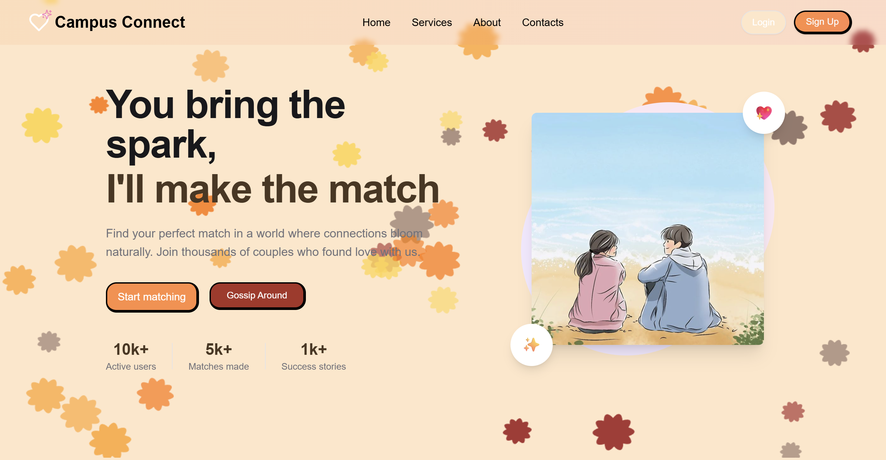

# ❤️ Campus Connect

> Where love meets gossip. The fun way to date in college.

---

## 🌟 About The Project

In college, students often have crushes but hesitate to express them due to the fear of rejection or social awkwardness. Existing dating apps can feel too serious or unsafe for the tight-knit campus environment. **Campus Crush** solves this by providing a college-exclusive social and dating platform that's fun, lighthearted, and community-driven.

It's a rejection-proof space where students can safely express interest in their crushes and only get matched when the feeling is mutual. More than just a dating app, it's a social hub where the community can playfully gossip and speculate about potential pairs, keeping engagement alive for everyone.



### Why It's Unique
* **🎓 College-Exclusive:** Creates a targeted and safer environment using college email verification.
* **💞 Rejection-Proof Design:** Matches only happen when interest is mutual, removing the fear of one-sided awkwardness.
* **🔥 Social + Dating Hybrid:** The unique "gossip" feature makes the app fun and engaging even if you don't have a match. It's about playful participation, not just swiping.

---

### ⭐ Key Features

* **🔍 Search Your Crush:** Easily find and "like" anyone from your college community to add them to your private crush list.
* **❤️ Find Your Match:** If your crush likes you back, you both get a notification!
* **⭐ Show Your Interest:** "Star" a profile as a subtle way to signal attraction without sending a direct like.
* **💬 Gossip on a Pair (Unique Selling Point):** The heart of the app! Users can playfully speculate and comment on potential pairs, keeping the entire campus community buzzing with activity.

---

## 🛠️ Built With

This project leverages a modern, scalable, and real-time tech stack to deliver a fast and interactive user experience.

* **Frontend:**
    * [Next.js](https://nextjs.org/)
    * [Tailwind CSS](https://tailwindcss.com/)
* **Backend:**
    * [Node.js](https://nodejs.org/)
    * [Express.js](https://expressjs.com/)
* **Database:**
    * [MongoDB](https://www.mongodb.com/)
* **Real-time Features:**
    * [Pusher](https://pusher.com/) (For instant gossip updates & live match notifications)
* **Authentication:**
    * [JSON Web Tokens (JWT)](https://jwt.io/) (with college email verification)
* **Deployment:** [Vercel](https://vercel.com/) 

---

## 🚀 Getting Started

To get a local copy up and running, follow these simple steps.

### Prerequisites

* Node.js (v14 or later)
* npm (Node Package Manager)
* MongoDB instance (local or cloud)

### Installation

1.  **Clone the repository:**
    ```sh
    git clone [https://github.com/your-username/campus-crush.git](https://github.com/shilpi9608/dating.git)
    ```
2.  **Navigate to the project directory and install dependencies** (this may vary based on your final project structure, e.g., monorepo vs. separate client/server folders):
    ```sh
    cd dating
    npm install
    ```
3.  **Create a `.env.local` file** and add your environment variables:
    ```
    MONGO_URI=your_mongodb_connection_string
    JWT_SECRET=your_jwt_secret
    PUSHER_APP_ID=...
    PUSHER_KEY=...
    PUSHER_SECRET=...
    ```

---

## 🗺️ Roadmap

We have exciting plans for the future!

* [ ] Expand from college-only to alumni networks.
* [ ] Add group chat rooms and event integration for matches.
* [ ] Introduce AI-based crush recommendations.
* [ ] Partnerships with campus events and fests.

See the [open issues](https://github.com/shilpi9608/dating/issues) for a full list of proposed features (and known issues).

---

## 🤝 Contributing

Contributions are what make the open-source community such an amazing place to learn, inspire, and create. Any contributions you make are **greatly appreciated**.

1.  Fork the Project
2.  Create your Feature Branch (`git checkout -b feature/AmazingFeature`)
3.  Commit your Changes (`git commit -m 'Add some AmazingFeature'`)
4.  Push to the Branch (`git push origin feature/AmazingFeature`)
5.  Open a Pull Request
